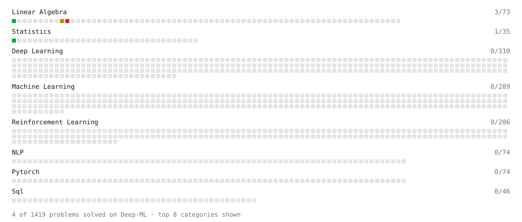

# Deep-ML

My machine learning practice from [Deep-ML](https://www.deep-ml.com). Every solution here was written by hand.

**40** solved · 40 problems · 0 labs · 0 math

[**Browse the interactive portfolio**](https://Hepisces.github.io/deep-ml/) to replay this filling in over time.

## Problems

| | Difficulty | Solved | |
| --- | --- | --- | --- |
| [Batch Iterator for Dataset](https://www.deep-ml.com/problems/30) | easy | 2024-11-10 | [solution](problems/0030-batch-iterator-for-dataset) |
| [Calculate 2x2 Matrix Inverse](https://www.deep-ml.com/problems/8) | easy | 2024-11-03 | [solution](problems/0008-calculate-2x2-matrix-inverse) |
| [Calculate Accuracy Score](https://www.deep-ml.com/problems/36) | easy | 2024-11-10 | [solution](problems/0036-calculate-accuracy-score) |
| [Calculate Covariance Matrix](https://www.deep-ml.com/problems/10) | easy | 2024-10-27 | [solution](problems/0010-calculate-covariance-matrix) |
| [Calculate Mean by Row or Column](https://www.deep-ml.com/problems/4) | easy | 2024-10-29 | [solution](problems/0004-calculate-mean-by-row-or-column) |
| [Calculate R-squared for Regression Analysis](https://www.deep-ml.com/problems/69) | easy | 2024-12-25 | [solution](problems/0069-calculate-r-squared-for-regression-analysis) |
| [Convert Vector to Diagonal Matrix](https://www.deep-ml.com/problems/35) | easy | 2024-10-29 | [solution](problems/0035-convert-vector-to-diagonal-matrix) |
| [Feature Scaling Implementation](https://www.deep-ml.com/problems/16) | easy | 2024-11-04 | [solution](problems/0016-feature-scaling-implementation) |
| [Implement Compressed Row Sparse Matrix (CSR) Format Conversion](https://www.deep-ml.com/problems/65) | easy | 2024-11-03 | [solution](problems/0065-implement-compressed-row-sparse-matrix-csr-format-conversion) |
| [Implement F-Score Calculation for Binary Classification](https://www.deep-ml.com/problems/61) | easy | 2024-11-10 | [solution](problems/0061-implement-f-score-calculation-for-binary-classification) |
| [Implement Gini Impurity Calculation for a Set of Classes](https://www.deep-ml.com/problems/64) | easy | 2024-11-10 | [solution](problems/0064-implement-gini-impurity-calculation-for-a-set-of-classes) |
| [Implement Orthogonal Projection of a Vector onto a Line](https://www.deep-ml.com/problems/66) | easy | 2024-11-03 | [solution](problems/0066-implement-orthogonal-projection-of-a-vector-onto-a-line) |
| [Implement Precision Metric](https://www.deep-ml.com/problems/46) | easy | 2024-11-10 | [solution](problems/0046-implement-precision-metric) |
| [Implement Recall Metric in Binary Classification](https://www.deep-ml.com/problems/52) | easy | 2024-11-10 | [solution](problems/0052-implement-recall-metric-in-binary-classification) |
| [Implement Ridge Regression Loss Function](https://www.deep-ml.com/problems/43) | easy | 2024-11-10 | [solution](problems/0043-implement-ridge-regression-loss-function) |
| [Linear Kernel Function](https://www.deep-ml.com/problems/45) | easy | 2024-11-10 | [solution](problems/0045-linear-kernel-function) |
| [Linear Regression Using Gradient Descent](https://www.deep-ml.com/problems/15) | easy | 2024-11-04 | [solution](problems/0015-linear-regression-using-gradient-descent) |
| [Linear Regression Using Normal Equation](https://www.deep-ml.com/problems/14) | easy | 2024-11-03 | [solution](problems/0014-linear-regression-using-normal-equation) |
| [Matrix-Vector Dot Product](https://www.deep-ml.com/problems/1) | easy | 2024-10-19 | [solution](problems/0001-matrix-vector-dot-product) |
| [One-Hot Encoding of Nominal Values](https://www.deep-ml.com/problems/34) | easy | 2024-11-10 | [solution](problems/0034-one-hot-encoding-of-nominal-values) |
| [Random Shuffle of Dataset](https://www.deep-ml.com/problems/29) | easy | 2024-11-10 | [solution](problems/0029-random-shuffle-of-dataset) |
| [Reshape Matrix](https://www.deep-ml.com/problems/3) | easy | 2024-10-29 | [solution](problems/0003-reshape-matrix) |
| [Scalar Multiplication of a Matrix](https://www.deep-ml.com/problems/5) | easy | 2024-10-29 | [solution](problems/0005-scalar-multiplication-of-a-matrix) |
| [Softmax Activation Function Implementation ](https://www.deep-ml.com/problems/23) | easy | 2026-09-21 | [solution](problems/0023-softmax-activation-function-implementation) |
| [Transformation Matrix from Basis B to C](https://www.deep-ml.com/problems/27) | easy | 2024-10-28 | [solution](problems/0027-transformation-matrix-from-basis-b-to-c) |
| [Transpose of a Matrix](https://www.deep-ml.com/problems/2) | easy | 2024-10-28 | [solution](problems/0002-transpose-of-a-matrix) |
| [2D Translation Matrix Implementation](https://www.deep-ml.com/problems/55) | medium | 2024-11-02 | [solution](problems/0055-2d-translation-matrix-implementation) |
| [Calculate Correlation Matrix](https://www.deep-ml.com/problems/37) | medium | 2024-10-30 | [solution](problems/0037-calculate-correlation-matrix) |
| [Calculate Eigenvalues of a Matrix](https://www.deep-ml.com/problems/6) | medium | 2024-11-03 | [solution](problems/0006-calculate-eigenvalues-of-a-matrix) |
| [Gauss-Seidel Method for Solving Linear Systems](https://www.deep-ml.com/problems/57) | medium | 2024-11-03 | [solution](problems/0057-gauss-seidel-method-for-solving-linear-systems) |
| [Gaussian Elimination for Solving Linear Systems](https://www.deep-ml.com/problems/58) | medium | 2024-11-03 | [solution](problems/0058-gaussian-elimination-for-solving-linear-systems) |
| [Implement Reduced Row Echelon Form (RREF) Function](https://www.deep-ml.com/problems/48) | medium | 2024-11-02 | [solution](problems/0048-implement-reduced-row-echelon-form-rref-function) |
| [K-Means Clustering](https://www.deep-ml.com/problems/17) | medium | 2024-12-25 | [solution](problems/0017-k-means-clustering) |
| [Matrix times Matrix ](https://www.deep-ml.com/problems/9) | medium | 2024-11-03 | [solution](problems/0009-matrix-times-matrix) |
| [Matrix Transformation ](https://www.deep-ml.com/problems/7) | medium | 2024-11-03 | [solution](problems/0007-matrix-transformation) |
| [Solve Linear Equations using Jacobi Method](https://www.deep-ml.com/problems/11) | medium | 2024-10-27 | [solution](problems/0011-solve-linear-equations-using-jacobi-method) |
| [Determinant of a 4x4 Matrix using Laplace's Expansion (hard)](https://www.deep-ml.com/problems/13) | hard | 2024-10-28 | [solution](problems/0013-determinant-of-a-4x4-matrix-using-laplace-s-expansion-hard) |
| [Implement the Conjugate Gradient Method for Solving Linear Systems](https://www.deep-ml.com/problems/63) | hard | 2024-11-03 | [solution](problems/0063-implement-the-conjugate-gradient-method-for-solving-linear-systems) |
| [Singular Value Decomposition (SVD) of 2x2 Matrix](https://www.deep-ml.com/problems/12) | hard | 2024-10-27 | [solution](problems/0012-singular-value-decomposition-svd-of-2x2-matrix) |
| [SVD of a 2x2 Matrix](https://www.deep-ml.com/problems/28) | hard | 2024-10-29 | [solution](problems/0028-svd-of-a-2x2-matrix) |

---

_This file is regenerated by Deep-ML on every push._
